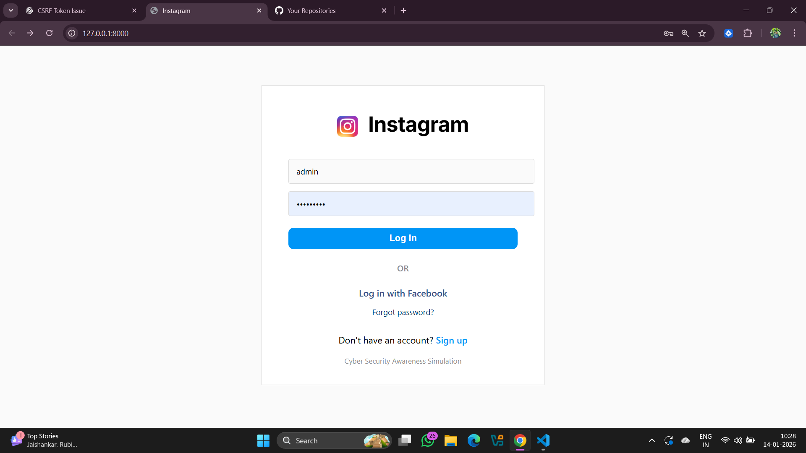
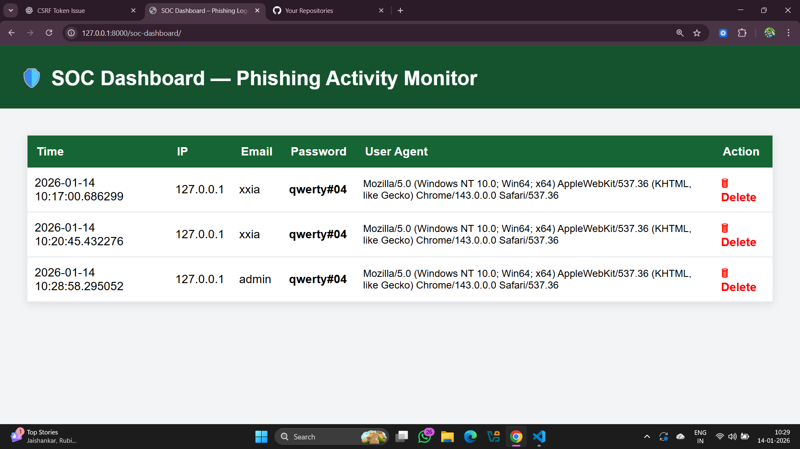

# 🛡️ InstaPhish SOC Lab

A **Django-based phishing simulation and SOC dashboard lab** built for cyber-security training, phishing awareness, and log analysis practice.

⚠️ **For educational use only.** Do NOT use this against real people, networks, or systems.

---

## 🔐 Overview

This lab simulates:
- A **fake Instagram login page**
- A backend that logs submitted credentials (locally, for demo)
- A **SOC Analyst Dashboard** to view and triage captured events
- Basic logging of IP address, timestamp, and user agent
- Ability to delete individual logged entries

Ideal for:
✅ Phishing awareness workshops  
✅ SOC analyst training  
✅ Blue-team log parsing exercises  
✅ Demonstrating defensive controls

## 📸 Screenshots

### Instagram-style Phishing Page


### SOC Analyst Dashboard


---

## 🧱 Features

| Feature | Description |
|---------|-------------|
| Fake Login Simulator | Mimics Instagram login UI |
| Log Capture | Stores username + password + metadata |
| SOC Dashboard | Table view of captured events |
| Deletion | Simulated alert removal |
| Django Framework | Modular and customizable |

---

## 🚀 Getting Started

### Prerequisites

```bash
pip install django
